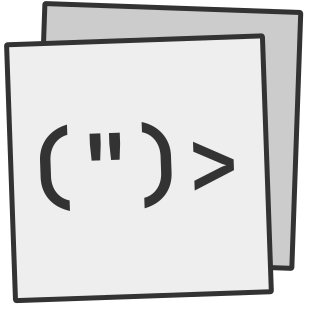

# Penguist
Penguist is an embeddable presenation library written in Typescript, designated to make fast and simple presentations. It can be embedded via a single js file, as well as using npm package.


<br>

## Index
- [Example](#example)
- [*Other contents are under construction 🏗*](#other-contents-are-under-construction-)

## Example
```html
<!DOCTYPE html>

<head>
  <title>W Rizz</title>
  <link rel="icon" href="penguist/assets/penguist.svg">
  <script src="penguist.min.js"></script>

  <style>
    body {
      font-family: 'Hack';
      margin: 4rem 8rem;
    }

    .title {
      position: absolute;
      top: 0;
      left: 0;
      width: 100%;
      height: 100%;
      display: flex;
      align-items: center;
      justify-content: center;
      text-align: center;
    }
  </style>
</head>

<p-present>
  <p-slide class="title">
    <div>
      <template>
        <slot>sdasd</slot>
      </template>

      <panim-fade start="with-prev">
        <h1>(")> Penguist</h1>
        <p>An embeddable presentation library written in <strong style="color: darkblue;">slowscript</strong></p>
      </panim-fade>

      <panim-fade style="margin-top: 1rem;">
        
      </panim-fade>
    </div>
  </p-slide>
  <p-slide>
    <ptemp-main view-num="1" view-title="Hello Penguist">
      <p>Quisque nec risus pulvinar lacus aliquet accumsan. Proin varius molestie tortor ut pulvinar. Sed volutpat pretium eros eget bibendum. Integer pharetra, ante a pharetra laoreet, ipsum erat posuere diam, vel condimentum enim tortor eget nulla. Aliquam suscipit, magna tempus finibus semper, ex ex suscipit est, semper rhoncus velit nisl eu nunc. Aliquam vel quam dolor. Vivamus porttitor sapien quis dapibus porta. Nulla lobortis efficitur quam id sodales. Orci varius natoque penatibus et magnis dis parturient montes, nascetur ridiculus mus. Proin justo ipsum, tincidunt eu mauris tincidunt, placerat consectetur turpis.</p>
    </ptemp-main>
    <panim-fade start="with-prev" style="margin-top: 1rem;">
  </p-slide>
  <p-slide>
    <ptemp-main view-num="2" view-title="Hello Penguin">
      <p>Sed eget condimentum mi. Proin congue et lacus et pulvinar. Nam id blandit mi. Proin dui elit, rutrum vitae orci a, tincidunt pulvinar velit. Vivamus a diam egestas, convallis ligula quis, vestibulum purus. Ut lacus mauris, bibendum at convallis non, finibus at diam. Vestibulum scelerisque, erat non facilisis finibus, lorem metus dictum quam, eu maximus augue nisi accumsan nisl. Cras auctor varius elit, ut pharetra ligula porta vulputate. In eu turpis felis. Etiam vitae enim sed felis rutrum vestibulum in non nisi. Nulla facilisi. Pellentesque tincidunt consequat leo blandit congue.</p>
      <p>Maecenas massa lacus, cursus ut ullamcorper sit amet, venenatis sed velit. Phasellus consectetur arcu vel dui gravida mollis. Cras mollis quam sapien. Phasellus at orci at ante maximus egestas. Proin eget posuere diam, in blandit nulla. Maecenas in dictum nunc, non sagittis lectus. Aenean libero ante, blandit id dignissim quis, luctus in justo. Ut bibendum, justo et eleifend egestas, magna elit aliquet tellus, sit amet malesuada metus ex sit amet nisi. Quisque rhoncus accumsan dui. Nunc nec tellus vitae est imperdiet eleifend. Proin sed ipsum a nisi blandit cursus id non sapien. Fusce rhoncus ex sed convallis ullamcorper. Aliquam semper orci a blandit facilisis. Vivamus fringilla, orci nec malesuada accumsan, massa urna hendrerit ex, in porta quam nisl sed diam. Aenean maximus tortor in suscipit facilisis. Vivamus aliquet ex sed ex tincidunt viverra.</p>
      <p>Nunc felis lorem, dictum vel pulvinar eu, aliquam nec nulla. Maecenas eu vulputate ante. Phasellus tincidunt ac urna dapibus gravida. Nulla facilisi. Nunc pretium auctor lacus accumsan dapibus. Ut commodo sed libero ut blandit. Mauris nunc nisi, fermentum vel odio non, gravida posuere nisi. Maecenas eget elit mollis neque bibendum auctor. Donec a elementum neque. Fusce scelerisque faucibus risus, euismod efficitur leo egestas tempus. Aenean nisi lorem, fermentum pellentesque blandit eget, posuere id mauris. Suspendisse aliquet diam eu nunc aliquam, et laoreet nisl porttitor. Fusce at efficitur dui.</p>
      </ptemp-main>
  </p-slide>
  <p-slide>
    <h2>Goodbye Penguist</h2>
    <panim-test start="with-prev" style="width: fit-content; font-size: 32pt;">
      🐧
    </panim-test>
  </p-slide>
</p-present>

<script>
  Penguist.init()

  Penguist.template('main')
    .html(`
      <panim-fade start="with-prev">
        <h2>
          <span class="number">{{ num }}</span> {{ title }}
        </h2>

        <slot></slot>
      </panim-fade>
    `)
    .css(`
    .number {
      color: #333;
      background: #eee;
      font-weight: bold;
      padding: .2rem .6rem;
      border: 3px solid #333;
      border-radius: .5rem;
    }`)
    .define()

  Penguist.anim('test')
    .frames([
      { transform: "rotate(0)" },
      { transform: "rotate(360deg)" },
    ])
    .opts({
      duration: 1000,
      iterations: Infinity
    })
    .define()
</script>
```

## Other contents are under construction 🏗
